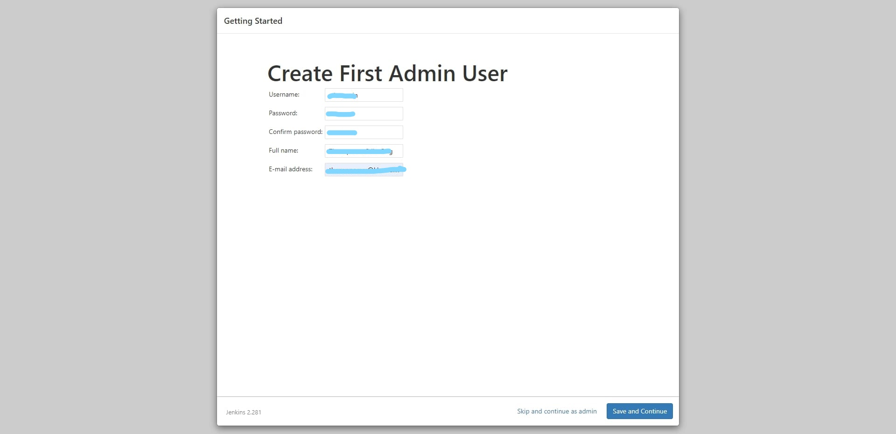

## ขั้นตอนการติดตั้ง **Jenkins**

### ขั้นตอนที่ 1 
ทำการดาวน์โหลด **Jenkins** จาก https://www.jenkins.io/download/
โดยเลือก **Download Jenkins version for : Windows**

	>ดาวน์โหลด https://www.oracle.com/java/technologies/javase-jre8-downloads.html
    >และทำการติดตั้ง
	

	
### ขั้นตอนที่ 2

เมื่อทำการดาวน์โหลดเสร็จแล้วให้ทำการติดตั้ง Jenkins

เลือกที่ต้องการติดตั้ง

<!-- กด __testport__ จากนั้นกด __Next__

	> Start port default ของ Jenkins จะใช้ :8082 หากในเครื่องมีเครื่องมืออื่นที่ใช้ port:8080 อยู่ Jenkins จะไม่ทำงาน -->

 >กด Insatll 

เมื่อติดตั้งเสร็จแล้วให้กด Finish จากนั้นจะมีหน้าเว็บขึ้นมา

	
จากนั้นให้นำ __Password__ ที่ได้จาก __PATH__ สีแดงมากรอก

เลือก insatall suggested plugins

เมื่อกรอก Password แล้วจะให้สร้าง User Admin ให้ทำการ Create User เมื่อเสร็จแล้วกด __Save__ __and__ __Continue__

กด Save and Finish

	> เมื่อสร้าง user admin สำเร็จ ให้ทำการ login เป็นการเสร็จสิ้นการติดตั้ง Jenkins
    > เมื่อสร้าง user admin สำเร็จ ให้ทำการ login เป็นการเสร็จสิ้นการติดตั้ง Jenkins

กดเลือก Manage Jenkins >> Manage Plugins จากนั้นค้นหา Robot Framework plugin แล้วกดติดตั้ง

